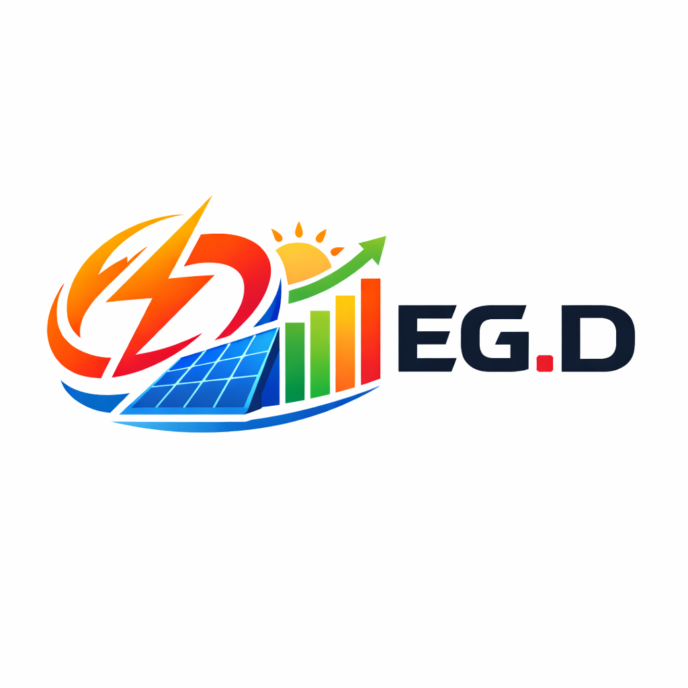

  

  
  

# EG.D OpenAPI pro Home Assistant

Custom integrace pro Home Assistant, která načítá naměřená data z **EG.D OpenAPI** a importuje je do statistik Home Assistantu jako kumulativní hodnoty energie. Integrace je vhodná pro uživatele s chytrým měřením u EG.D, kteří chtějí mít spotřebu a dodávku elektřiny přímo v Energy dashboardu, statistikách a automatizacích.

## K čemu integrace slouží

Integrace se připojuje k cloudovému rozhraní EG.D OpenAPI, stahuje profilová data pro zadané odběrné místo a převádí je do formátu, který Home Assistant umí používat jako energetické statistiky.

Typicky ji využijete, pokud chcete:

- zobrazit celkový odběr elektřiny v Home Assistantu,
- zobrazit celkovou dodávku do sítě, například z fotovoltaiky,
- doplnit historická data do statistik Home Assistantu,
- použít data v Energy dashboardu,
- mít přehled o poslední úspěšné synchronizaci a stavu posledních načtených dat.

## Hlavní funkce

- Podpora konfigurace přes grafické rozhraní Home Assistantu.
- Ověření `Client ID` a `Client Secret` už při přidání integrace.
- Načítání dat pro jedno konkrétní odběrné místo podle `EAN`.
- Samostatné nastavení profilu pro odběr a dodávku.
- Automatický denní import dat ve zvolený čas.
- Průběžná zpětná kontrola posledních dnů, aby se opravila opožděně zveřejněná nebo změněná data.
- Import dat do externích statistik Home Assistant Recorderu.
- Zachování mezistavu mezi restarty Home Assistantu.
- Servisní akce pro smazání importovaných statistik a reset lokálního checkpointu.

## Co integrace vytváří

Po úspěšném nastavení vzniknou dvě senzorové entity:

- `Celkový odběr`
- `Celková dodávka`

Obě entity mají jednotku `kWh` a jsou určené pro práci s energií v Home Assistantu.

Kromě hlavní hodnoty obsahují i doplňkové atributy, například:

- `ean`
- `last_api_sync_utc`
- `last_update_utc`
- `last_valid_import_timestamp`
- `last_valid_export_timestamp`
- `last_import_status`
- `last_export_status`

Díky tomu snadno poznáte, kdy proběhla poslední synchronizace a jaký byl stav posledního přijatého záznamu z API.

## Jak integrace funguje

Integrace stahuje data z EG.D OpenAPI po stránkách a při delším období si požadavky sama rozděluje na menší úseky. Záznamy následně seskupuje do hodinových statistik a ukládá je do Home Assistant Recorderu jako kumulativní energetické řady.

Chování synchronizace:

- při prvním spuštění se snaží načíst co největší dostupnou historii v rámci limitů EG.D,
- při dalších spuštěních kontroluje jen poslední konfigurovatelné období zpětně,
- pokud v době plánované synchronizace ještě nejsou k dispozici nejnovější data, průběžný watchdog zkusí načtení zopakovat později.

Importují se pouze záznamy se stavem, který integrace považuje za validní pro statistické zpracování.

## Podporované profily

Pro konfiguraci jsou aktuálně podporované tyto profily:

- odběr: `ICQ2`, `ICC1`
- dodávka: `ISQ2`, `ISC1`

Poznámka k převodu hodnot:

- profily `ICQ2` a `ISQ2` se používají přímo,
- profily `ICC1` a `ISC1` integrace převádí na `kWh` dělením čtyřmi.

## Omezení a specifika EG.D API

Je dobré počítat s několika vlastnostmi zdrojového API:

- EG.D typicky zpřístupňuje data pouze do včerejška, ne do aktuálního dne.
- Poslední dostupný interval dne bývá `23:45`.
- API má klouzavý limit přibližně 3 roky historie.
- Některé profily mají navíc omezený začátek dostupnosti dat.
- Delší časová období se musí stahovat po menších částech.
- Data mohou být zveřejněná se zpožděním, proto existuje zpětná revalidace posledních dnů.

## Požadavky

Pro použití potřebujete:

- funkční Home Assistant s Recorderem,
- přístup do EG.D OpenAPI,
- `Client ID` a `Client Secret`,
- `EAN` odběrného místa, pro které máte oprávnění číst data.

## Instalace

### Instalace přes HACS

Pokud tento repozitář používáte přes HACS:

1. Přidejte repozitář jako custom repository.
2. Vyhledejte integraci `E.GD OpenAPI Integrace pro HomeAssistant`.
3. Nainstalujte ji.
4. Restartujte Home Assistant.

### Ruční instalace

1. Zkopírujte složku [`custom_components/ha_egd_openapi`](/Users/coolajz/Documents/GitHub/ha_egd_openapi/custom_components/ha_egd_openapi) do svého Home Assistant projektu do adresáře `custom_components`.
2. Restartujte Home Assistant.

## Konfigurace v Home Assistantu

Integrace se přidává přes:

`Nastavení` -> `Zařízení a služby` -> `Přidat integraci` -> `EG.D OpenAPI`

### Konfigurační položky

- `Název`: uživatelský název zařízení v Home Assistantu.
- `EAN odběrného místa`: identifikátor odběrného místa.
- `Client ID`: přístupový identifikátor pro EG.D OpenAPI.
- `Client Secret`: tajný klíč pro EG.D OpenAPI.
- `Profil spotřeby`: profil pro odběr.
- `Profil přetoků`: profil pro dodávku.
- `Hodina denní synchronizace`: kdy se má provádět pravidelný denní import.
- `Minuta denní synchronizace`: minuta pravidelné synchronizace.
- `Kolik dnů zpětně kontrolovat`: počet dní, které se mají při každé synchronizaci znovu ověřit.

### Výchozí hodnoty

- název: `EG.D Smart Meter`
- čas denní synchronizace: `16:17`
- zpětná kontrola: `31` dní
- profil odběru: `ICQ2`
- profil dodávky: `ISQ2`

## Doporučené nastavení

- Denní synchronizaci nastavte na čas, kdy už bývají v EG.D dostupná data za předchozí den.
- Pokud EG.D někdy doplňuje nebo opravuje data se zpožděním, ponechte zpětnou kontrolu alespoň několik týdnů.
- Pro Energy dashboard používejte entity vytvořené touto integrací, případně statistiky, které z nich Home Assistant odvodí.

## Servisní akce

Integrace registruje službu:

- `ha_egd_openapi.egd_remove_statistics_entity`

Tato služba:

- smaže importované statistiky odběru a dodávky,
- odstraní uložené checkpointy integrace,
- vynutí, aby se historie při další synchronizaci znovu sestavila.

Volitelné parametry:

- `entry_id`: smaže statistiky jen pro konkrétní konfigurační záznam,
- `ean`: smaže statistiky jen pro konkrétní EAN.

Použití je vhodné například při:

- změně logiky importu,
- opravě poškozených statistik,
- přepnutí na jiné měřené místo,
- testování nebo ladění integrace.

## Řešení problémů

### Nepodařilo se spojit s API

Zkontrolujte:

- správnost `Client ID`,
- správnost `Client Secret`,
- že máte aktivní přístup do EG.D OpenAPI,
- že API EG.D není dočasně nedostupné.

### Integrace je přidaná, ale nepřichází nová data

Možné příčiny:

- EG.D ještě nezveřejnilo data za předchozí den,
- nastavený čas synchronizace je příliš brzy,
- pro zadaný `EAN` nebo profil nejsou data dostupná,
- poslední záznamy nemají validní stav pro import do statistik.

### Chci nahrát historii znovu

Použijte službu `ha_egd_openapi.egd_remove_statistics_entity` a následně nechte integraci znovu provést synchronizaci.

## Pro koho je integrace vhodná

Integrace je určená hlavně pro uživatele v ČR, kteří:

- mají distribuční území EG.D,
- používají Home Assistant,
- chtějí dlouhodobě ukládat a vyhodnocovat spotřebu nebo dodávku elektřiny,
- chtějí data dostat do nativních statistik Home Assistantu bez ručního importu.
